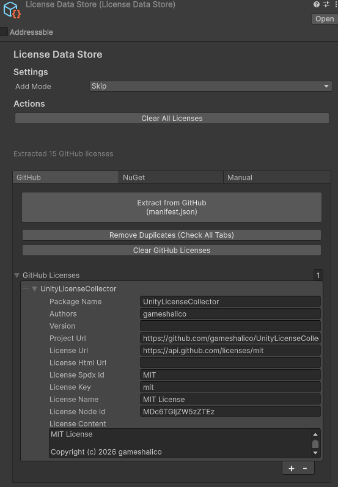
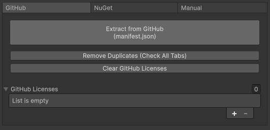
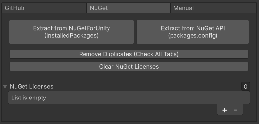
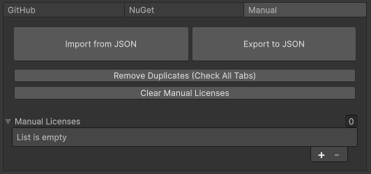

# UnityLicenseCollector
[](https://opensource.org/licenses/MIT)

[English version](./README.md)

UnityプロジェクトにおけるGitHubパッケージとNuGetパッケージのライセンス情報を自動取得し、ScriptableObjectに保存するエディタ拡張ツールです。

## 概要

UnityLicenseCollectorは、プロジェクトで使用している外部パッケージのライセンス情報を一元管理するためのツールです。以下の3つのソースからライセンス情報を取得できます。

- **GitHub**: `Packages/manifest.json`に記載されたGitHubパッケージ
- **NuGet**: NuGetパッケージマネージャー経由でインストールされたパッケージ
- **Manual**: 手動で追加するカスタムライセンス情報





## インストール

### インストール手順

1. Unity Package Managerを開く（Window > Package Manager）
2. 左上の「+」ボタンをクリック
3. 「Add package from git URL」を選択
4. 以下のURLを入力
   ```
   https://github.com/gameshalico/UnityLicenseCollector.git?path=Assets/UnityLicenseCollector
   ```

### オプション

- NuGetパッケージのライセンスを取得する場合は、以下のいずれかが必要です
  - [NuGet Importer](https://github.com/kumaS-nu/NuGet-importer-for-Unity)
  - [NuGetForUnity](https://github.com/GlitchEnzo/NuGetForUnity)

※ OpenUPMには対応していません

## 使い方

### 1. LicenseDataStoreの作成

1. Projectウィンドウで右クリック
2. `Create > UnityLicenseCollector > LicenseDataStore`を選択
3. 任意の場所に保存（例: `Assets/LicenseData.asset`）

### 2. ライセンス情報の取得

作成した`LicenseDataStore`をInspectorで選択すると、3つのタブが表示されます。

#### GitHubタブ



GitHubからパッケージのライセンス情報を取得します。

1. **GitHub**タブを選択
2. **Extract from GitHub (manifest.json)** ボタンをクリック
3. 自動的に`Packages/manifest.json`を読み込み、GitHub URLを持つパッケージのライセンスを取得

**機能:**
- `Packages/manifest.json`から自動的にGitHubパッケージを検出
- GitHub API経由でライセンステキストを取得
- **Remove Duplicates**: 他タブと重複するパッケージを削除
- **Clear GitHub Licenses**: GitHubライセンスのみクリア

#### NuGetタブ



NuGetパッケージのライセンス情報を取得します。

##### ローカルパッケージから取得

1. **NuGet**タブを選択
2. **Extract from NuGetForUnity (InstalledPackages)** ボタンをクリック
3. フォルダ選択ダイアログで`InstalledPackages`ディレクトリを選択
   - NuGetForUnityの場合: `Assets/Packages/`
   - NuGet Importerの場合: プロジェクトルートの`InstalledPackages/`
4. 自動的にライセンス情報を抽出

##### NuGet APIから取得

1. **NuGet**タブを選択
2. **Extract from NuGet API (packages.config)** ボタンをクリック
3. `packages.config`ファイルを選択
4. NuGet API経由でライセンス情報を取得

**機能:**
- ローカルの`.nuspec`ファイルからメタデータを取得
- `LICENSE`ファイルが存在すればそれを優先使用
- ライセンスファイルがない場合、GitHubフォールバックで取得を試行
- **Remove Duplicates**: 他タブと重複するパッケージを削除
- **Clear NuGet Licenses**: NuGetライセンスのみクリア

#### Manualタブ



手動でライセンス情報を管理します。

##### JSONからインポート

1. **Manual**タブを選択
2. **Import from JSON** ボタンをクリック
3. ライセンスデータを含むJSONファイルを選択

**JSONフォーマット例:**
```json
[
  {
    "PackageName": "MyCustomPackage",
    "Version": "1.0.0",
    "LicenseName": "MIT",
    "LicenseText": "MIT License\n\nCopyright (c) 2025...",
    "Author": "Author Name",
    "RepositoryUrl": "https://github.com/username/repo"
  }
]
```

##### JSONへエクスポート

1. **Manual**タブを選択
2. **Export to JSON** ボタンをクリック
3. 保存先を選択してエクスポート

**機能:**
- JSON形式でのインポート/エクスポート
- **Remove Duplicates**: 他タブと重複するパッケージを削除
- **Clear Manual Licenses**: 手動ライセンスのみクリア

### 3. ライセンス追加モード

Inspectorの上部にある**Add Mode**で、ライセンス追加時の動作を設定できます。

- **Skip**: 同名パッケージが既に存在する場合、追加をスキップ
- **Overwrite**: 既存のライセンス情報を上書き
- **Add**: 同名でも別エントリとして追加

### 4. 全データのクリア

**Clear All Licenses** ボタンで、すべてのタブのライセンスデータを一括削除できます。

## ライセンス取得の仕組み

### GitHub

1. `Packages/manifest.json`を解析してGitHub URLを抽出
2. GitHub API (`/repos/{owner}/{repo}/license`) でライセンス情報を取得
3. Base64エンコードされたライセンステキストをデコード
4. ScriptableObjectに保存

### NuGet（ローカル）

1. `InstalledPackages`ディレクトリからパッケージを検出
2. `.nuspec`ファイルをXMLパースしてメタデータ取得
3. `LICENSE*`ファイルが存在すればそれを使用
4. ライセンスファイルがない場合、`ProjectUrl`からGitHub URLを抽出してフォールバック
5. ScriptableObjectに保存

### NuGet（API）

1. `packages.config`からパッケージIDとバージョンを取得
2. NuGet API (`v3-flatcontainer`) で`.nuspec`をダウンロード
3. `.nuspec`をXMLパースしてライセンス情報を取得
4. ライセンスがない場合、GitHubフォールバック処理を実行
5. ScriptableObjectに保存

## トラブルシューティング

### GitHubライセンスが取得できない

- GitHub APIのレート制限に達している可能性があります（1時間に60リクエスト）
- パッケージにライセンスファイルが存在しない可能性があります
- Consoleウィンドウでエラーメッセージを確認してください

### NuGetライセンスが取得できない

- `.nuspec`ファイルにライセンス情報が記載されていない可能性があります
- `ProjectUrl`がGitHubでない場合、フォールバックが動作しません
- ローカルの`InstalledPackages`ディレクトリパスが正しいか確認してください

### 重複エントリが表示される

- 各タブの**Remove Duplicates**ボタンでそのタブの重複したライセンスを削除できます
- **Add Mode**を**Skip**または**Overwrite**に設定すると、重複を防げます
